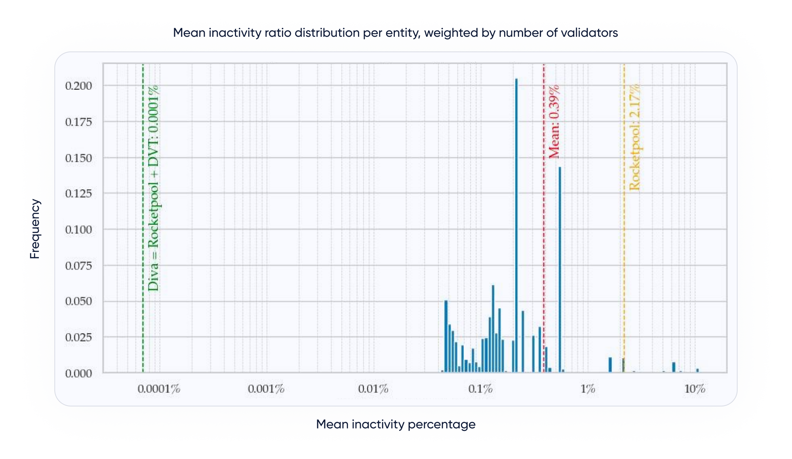

# Diva vs Rocketpool

Both Diva and Rocketpool are community-driven Liquid Staking solution run by permissionless node operators.

The main difference is in who performs the validation duties:

- Rocketpool runs on Proof of Stake, with Operators custodying full keys.
- Diva runs Distributed Proof of Stake, with keys being operated by network consensus.

## Rocketpool is operated by individual Operators

In Rocketpool, 8 or 16 ETH from a Node Operator are matched with 24 or 16 ETH from stakers.

The Node Operator receiving the matching ETH owns the validator and is trusted to operate it faithfully, as their own ETH is at stake.

The risk here is that is a Node Operator goes offline, loses their keys or gets hacked, they can unilaterally cause large amounts of damage to the validators they manage.

Rocketpool's decision to use 8-16 ETH collateral per validator come from studies like [“A Risk Analysis of Rocket Pool Low Ether Bonded (LEB) Minipools” by Ken Smith](https://github.com/htimsk/LEBminipools/blob/main/report/Analysis%20of%20LEB%20Minipools.pdf). Rocketpool has been operating in these levels without issues, suggesting that those ranges might be considered safe.

However, Rocketpool's operators are missing ~2.2% of their attestations, compared to only 0.3% for the average Ethereum operator, suggesting that their model could benefit from DVT.

## Diva works through committees of Operators

Diva uses a consensus of 2/3rds of 16 Operators to run every single validator, meaning that:

- Multiple Operators can be offline without any impact to the protocol.
- The risk of failure, hacks or malicious behavior is greatly reduced.

**Diva's unique strength comes into play here**: if a set of Operators with 5% downtime use Diva's DVT, they can perform at 99.99% uptime (0.01% downtime), thanks the DVT improvements.

[Diva's DVT system](dvt) provides novel risk mitigation mechanisms, thanks to its fault tolerance and consensus mechanisms preventing single Operators from causing damages.

With Diva, Operators require as little as 1 divETH [collateral](glossary#collateral), allowing for higher diversity and uptime, which means better [Staking Rewards](staking-rewards).

**Diva's DVT turns a set of 16 nodes with 95% uptime into a Distributed Validator with 99.99% uptime**

**The same nodes that today run Rocketpool could perform with 99.99% combined uptime**

